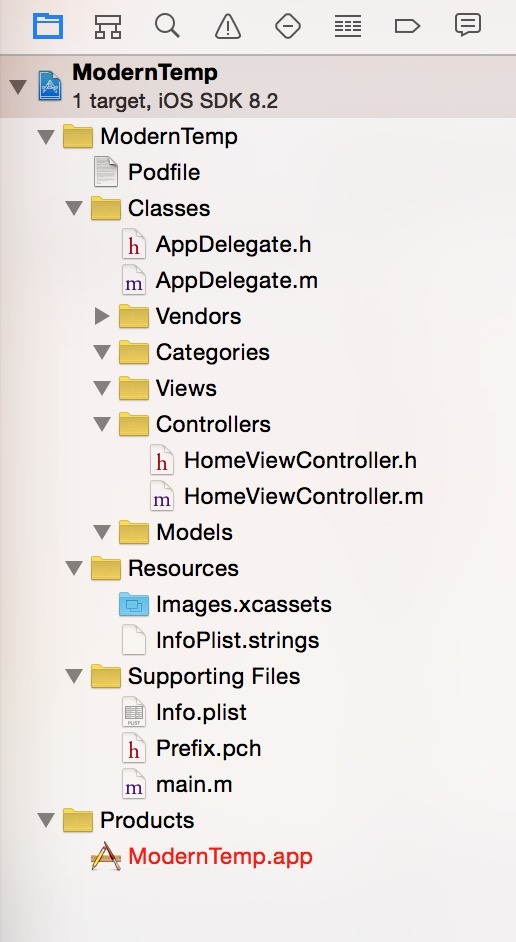

# Overview

如果你觉得Xcode默认的Single view controller project template不能满足你的通用需求。

1. 妈的没有pch文件了。
2. 妈的我不想要storyboard。
3. 妈的还要建一遍文件的目录结构, Models, Views, Controllers, Vendors。
4. 我想有个podfile。

这些这个Temp都帮你搞定了。

如图所示：

# How to make it

+ [!NSScreencast](http://nsscreencast.com/episodes/68-xcode-project-templates)
+ [!xcode-6-template](https://github.com/reidmain/Xcode-6-Project-Templates)

# Installation

运行目录下的install.sh。